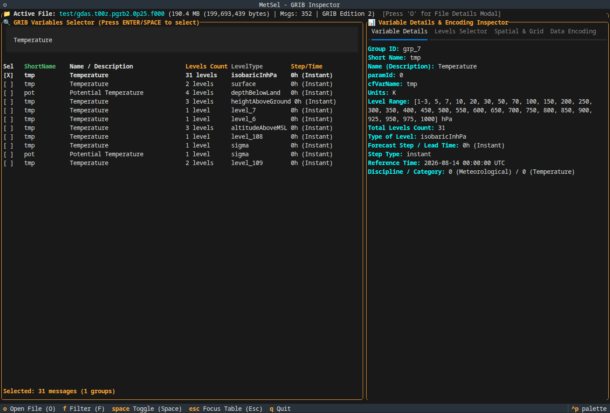

# MetSel 🌦️

**MetSel** is a terminal-native GRIB file inspector and variable selector TUI.

It provides an interactive terminal interface to quickly inspect GRIB files, perform fuzzy search across file paths and metadata, group variables by level coordinate systems, and select specific vertical levels.

---

## 📸 Screenshots

<!--
  Place terminal screenshots or GIF demos inside `./docs/screenshots/`:
  - `./docs/screenshots/main_interface.png`
  - `./docs/screenshots/levels_selector.png`
-->



---

## ✨ Features

- **🔍 Dynamic Fuzzy Search**: Quickly find GRIB files using path search or filter variables by name, level type, units, and categories.
- **📦 Smart Variable Grouping**: Automatically groups individual GRIB messages into distinct variable datasets by coordinate system.
- **📊 Level Selection**: Inspect and toggle individual vertical levels with **Select All** and **Select None** quick actions.
- **🎨 Terminal UI**: Clean `btop`-inspired interface with rounded borders and theme transparency.

---

## 🚀 Usage

Run directly using `uvx`:

```bash
# Launch interactive file selector
uvx metsel

# Or pass a GRIB file path directly
uvx metsel path/to/file.grib2
```

---

## 🛠️ Installation

Install `metsel` as a CLI tool:

```bash
uv tool install metsel
```

Run `metsel` anywhere:

```bash
metsel path/to/file.grib2
```

---

## ⌨️ Keybindings

| Key | Action |
| :--- | :--- |
| <kbd>O</kbd> | Open file selection modal |
| <kbd>F</kbd> | Focus the filter input box |
| <kbd>Esc</kbd> | Apply filter or return focus to the variable list |
| <kbd>Space</kbd> / <kbd>Enter</kbd> | Toggle highlighted variable group or level |
| <kbd>Q</kbd> | Quit MetSel |
